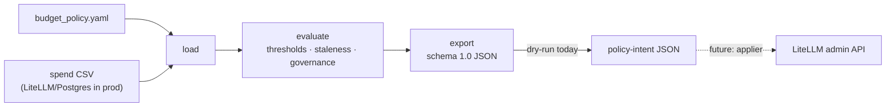

# AI Platform Budget Controller
 — **Tiered budget
enforcement with graceful downgrade.**

`budget-controller` reads a snapshot of accumulated per-team LLM spend, evaluates
it against a declarative policy (warn at 75%, again at 90%, enforce at 100%), and
emits per-team decisions plus a LiteLLM-shaped policy-intent JSON. **Dry-run
only** — it never calls LiteLLM, AWS, or Datadog, so the decision logic stays
pure and testable.

Design: [task1-design.md](task1-design.md) · target-state diagram:
[task3-architecture.drawio](task3-architecture.drawio)
([diagrams.net](https://app.diagrams.net)).


It exercises the brief's cost-governance goal directly, and the hard parts are
judgement calls rather than plumbing: **which workloads tolerate a silent model
downgrade**, and **how to act on spend data that is always stale**. It drops onto
the existing stack (LiteLLM + Postgres) as a periodic controller.

## Architecture



### How it works

1. **`spend_loader.load_spend`** — parse the CSV (stdlib `csv`), aggregate by
   team / API key / model. Bad values never raise; they are coerced and flagged
   (`missing_team`, `blank_cost`, `negative_cost`, `zero_requests_nonzero_cost`,
   `unparseable_row`). The snapshot exposes `as_of` = max row date.
2. **`policy.load_policy`** — load + validate `budget_policy.yaml` (Pydantic).
   Duplicate keys, bad thresholds, unknown actions, and dangling model
   references all fail with one `PolicyError`.
3. **`evaluator.evaluate(policy, snapshot, *, now)`** — pure, clock injected.
   Per team, on the raw spend fraction: `<75%` → `allow` · `75–90%` → `warn` ·
   `90–100%` → `urgent_warn` · `≥100%` → the team's `at_100_percent` action
   (boundaries land on the stricter side).
   - `downgrade` resolves a concrete `from`/`to` model; if the target is not a
     cheaper tier it falls back to `throttle`.
   - Un-attributed spend is not scored against a budget — it is `quarantine`d.
   - **Staleness:** past `max_staleness_hours`, `hold_relaxations` is set —
     enforcement may be *raised* from stale data, never *lowered*. Actions are
     annotated, never rewritten.
   - `governance_violations` also flags `unknown_team` and `off_catalogue_model`.
4. **`exporters.build_export`** — a stable `schema_version: "1.0"` document
   (metadata, `summary`, `intents`, `governance_violations`). Action →
   admin-API-shaped `changes`:

   | action | effect |
   |---|---|
   | `allow` | `clear_overrides` — unless `hold_relaxations`, then `held` |
   | `warn` / `urgent_warn` | notification(s) only |
   | `throttle` | scale team RPM/TPM/parallel limits to `throttle_to_pct` |
   | `downgrade` | reroute the team alias + `app_signal` + projected saving |
   | `require_explicit_signal` | keep serving, `app_signal` only |
   | `block` / `quarantine` | block, manual `recovery` |

   The `changes` are a **stable intermediate representation, not a LiteLLM wire
   payload.** A thin applier (future work) translates each into an admin-API
   call (`/team/update`, `/key/block`, …) and resolves relative values — e.g.
   `throttle`'s `scale` factor — against the gateway's live limits. Keeping the
   decision engine decoupled from LiteLLM's exact API is deliberate: the schema
   is versioned so it can be pinned down against a real gateway later.

## Layout

```
config/budget_policy.yaml   all tunable behaviour: thresholds, budgets, per-team actions
data/spend_30d.csv          input spend snapshot (from the brief)
src/budget_controller/
  models.py                 enums + Pydantic policy models + Decision + spend dataclasses
  policy.py                 load_policy() + PolicyError
  spend_loader.py           load_spend() + SpendLoadError
  evaluator.py              evaluate() -> EvaluationResult
  exporters.py              build_export() / export_json()
  cli.py                    `budget-controller evaluate`
tests/                      93 tests; fixtures in tests/fixtures/
```

## Setup & run

Python **3.13**, [`uv`](https://docs.astral.sh/uv/).

```bash
uv sync
uv run pytest                 # 93 tests
uv run ruff check . && uv run ruff format --check .

uv run budget-controller evaluate                       # table (defaults: data/, config/)
uv run budget-controller evaluate --as-of 2025-12-01    # pin the clock (staleness)
uv run budget-controller evaluate --format json         # schema 1.0 policy-intent JSON
uv run budget-controller evaluate --export-litellm intent.json
uv run budget-controller evaluate --strict              # exit 1 on any finding (CI/cron)
```

Exit codes: `0` ok · `1` findings under `--strict` · `2` bad/unreadable input.
Tests cover policy validation, every malformed-row kind, the threshold
boundaries, each action, staleness, the exporter document, and the CLI paths.

## Config & data

**`config/budget_policy.yaml`** holds all behaviour — the code has no hard-coded
team names or numbers: global thresholds (`0.75`/`0.90`/`1.00`),
`max_staleness_hours`, `throttle_to_pct`, a model price table, and per team a
budget, allowed models, `at_100_percent` action, `silent_downgrade_allowed`, and
escalation channel.

**`data/spend_30d.csv`** is treated as a near-real-time (but stale) spend
snapshot. It contains deliberate defects the controller surfaces rather than
absorbs: un-attributed spend (`key-personal-mhuber`, ~$2k), a blank cost, a
zero-request / non-zero-cost row, and two teams using an off-catalogue model.

**Budgets are an assumption** (the brief leaves per-team envelopes open), derived
from the sample so every tier fires:

| Team | 30d spend | Budget | ~% | Decision |
|---|---:|---:|---:|---|
| DevAgent | $20,153 | $18,000 | 112% | `throttle` (write-capable) |
| AdvisorChat | $9,180 | $10,000 | 92% | `urgent_warn` |
| KYC | $2,795 | $3,600 | 78% | `warn` (`block` at 100%) |
| DigestBot | $1,990 | $2,600 | 77% | `warn` (`downgrade` at 100%) |
| Research | $335 | $1,000 | 34% | `allow` |
| Marketing | $8 | $500 | 2% | `allow` |
| _unowned_ | $2,003 | — | — | `quarantine` |

## Key decisions

- **Silent downgrade is per team.** AdvisorChat (customer-facing) →
  `require_explicit_signal`; KYC (regulated) → `block`; DevAgent (write-capable
  tools) → `throttle`; batch / internal → silent `downgrade`.
- **Stale data may raise enforcement, never lower it** (`hold_relaxations`).
- **Missing ownership is a governance failure**, not a rounding error —
  quarantined regardless of amount.
- **The clock is injected** (`evaluate(now=)`, `--as-of`) so runs reproduce.
- **stdlib `csv`, no pandas** — ~150 rows, auditability over convenience.

## Not in v1 / next steps

Out of scope so the logic stays pure: live LiteLLM mutation, Postgres, AWS /
Datadog / Slack, hot-path pre-call enforcement, forecasting, multi-currency.

| Area | Next |
|---|---|
| Spend source | read from LiteLLM / Postgres; keep the `SpendSnapshot` interface |
| Apply | an applier turning `changes` into LiteLLM admin API calls, honouring `hold_relaxations` |
| Deploy | Terraform: scheduled ECS task / Lambda via EventBridge, least-privilege IAM |
| Observability | emit burn-rate / downgrade / `stale`-run metrics to Datadog |
| Policy | DevAgent read/write split; per-route budgets; time-window resets |
