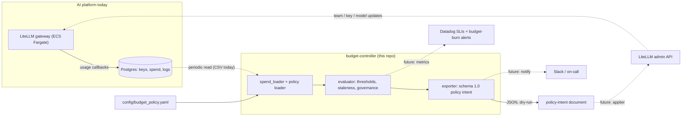

# AI Platform Budget Controller

Take-home for an AI Platform Engineer role. **Task 2, Option B: tiered budget
enforcement with graceful downgrade.**

`budget-controller` is the *policy brain* of tiered budget enforcement. It reads
a snapshot of accumulated per-team LLM spend, evaluates it against a declarative
budget policy (warn at 75%, warn harder at 90%, enforce at 100%), and emits a
deterministic set of decisions plus a LiteLLM-shaped policy-intent document that
a worker could apply to the gateway. Version 1 is **dry-run**: it never calls
LiteLLM, AWS, or Datadog, so the decision logic stays pure and fully testable.

- Design document: [task1-design.md](task1-design.md)
- Build plan (8 tickets): [task2-plan.md](task2-plan.md)
- Assignment brief: [docs/](docs/) *(git-ignored)*

## Why Option B

- It is the option that most directly exercises the brief's cost-governance
  goal: *"surface cost per team near real time, and stop a runaway request
  before it becomes a runaway invoice."*
- The interesting problems are judgement calls, not plumbing: **which workloads
  can tolerate a silent model downgrade and which cannot**, and **how to act on
  spend data that is always a little stale**. Both are addressed head-on below.
- It sits cleanly on the existing stack (LiteLLM + Postgres + Datadog) as a
  periodic controller, matching the "policy-driven platform" direction argued in
  the design document — teams call stable aliases, the platform decides budgets
  and routing.
- Small surface, real depth: one component, done end to end, with tests.

## Architecture



Solid arrows are built in this repo; dotted arrows are the production
integrations left as future work.

The full target-state diagram (Task 3) is
[`task3-architecture.drawio`](task3-architecture.drawio) — open it in
[diagrams.net](https://app.diagrams.net). It shows the current stack solid and
the proposed additions dashed-green, with colour-coded request / spend-loop /
trace / audit / metrics / self-service / agentic-tool paths and the assumptions
on-canvas.

**Flow:** spend source (a CSV here, LiteLLM/Postgres in production)
→ `budget-controller` (load → evaluate → export)
→ policy-intent JSON
→ *(future)* an applier pushes changes to the LiteLLM admin API
→ *(future)* Datadog carries the SLIs and budget-burn alerts, Slack the pages.

### How the evaluation works

1. **`spend_loader.load_spend`** parses the CSV with the standard library only
   and aggregates spend by team, API key, and model. Bad values never raise:
   they are coerced to a safe default and recorded as a `DataQualityFlag`
   (`missing_team`, `blank_cost`, `negative_cost`, `zero_requests_nonzero_cost`,
   `unparseable_row`). The snapshot exposes `as_of` (the max row date).
2. **`policy.load_policy`** loads and validates `budget_policy.yaml` with
   Pydantic. Duplicate team keys, out-of-order thresholds, unknown actions,
   missing budgets, and models a team references but that are not in the price
   table all fail with one actionable `PolicyError`.
3. **`evaluator.evaluate(policy, snapshot, *, now)`** is pure — the clock is
   injected. Per team, using the raw spend fraction:
   `< 75%` → `allow` · `75–90%` → `warn` · `90–100%` → `urgent_warn` ·
   `>= 100%` → the team's configured `at_100_percent` action. Exact boundaries
   land on the stricter side.
   - A `downgrade` action resolves a concrete `from`/`to` model from the price
     table; if the target is not a cheaper tier (team already on economy) it
     falls back to `throttle`.
   - Spend on an un-attributed key is not scored against a budget — it is
     `quarantine`d.
   - **Staleness:** `age = now − as_of`. Past `defaults.max_staleness_hours` the
     result sets `hold_relaxations`: enforcement may still be *raised* from stale
     data, but it must not be *lowered*. Actions are never silently rewritten,
     only annotated.
   - A top-level `governance_violations` list adds `unknown_team` (spend with no
     policy) and `off_catalogue_model` (a team using a model outside its
     allow-list).
4. **`exporters.build_export` / `export_json`** render the result as a stable
   `schema_version: "1.0"` document: metadata, a `summary`, an `intents` list,
   and the pass-through `governance_violations`. Each intent maps its action to
   admin-API-shaped `changes`:

   | action | gateway effect |
   |---|---|
   | `allow` | `clear_overrides` — unless `hold_relaxations`, then `held` |
   | `warn` / `urgent_warn` | notification(s) only, no gateway change |
   | `throttle` | scale team RPM/TPM/parallel limits to `throttle_to_pct` |
   | `downgrade` | reroute the team's default alias + `app_signal` + projected saving |
   | `require_explicit_signal` | keep serving, `app_signal` only |
   | `block` | block the team, manual `recovery` |
   | `quarantine` | block each un-attributed key, manual `recovery` |

## Repository layout

```
config/budget_policy.yaml     declarative policy: thresholds, budgets, per-team actions
data/spend_30d.csv            input spend snapshot (from the brief)
src/budget_controller/
  models.py                   Pydantic policy models + Decision; frozen-dataclass spend models
  policy.py                   load_policy() + PolicyError
  spend_loader.py             load_spend() + SpendLoadError
  evaluator.py                evaluate() -> EvaluationResult (+ GovernanceViolation)
  exporters.py                build_export() / export_json() -> schema 1.0 document
  cli.py                      `budget-controller evaluate`
tests/                        79 unit tests + 14 CLI tests; fixtures in tests/fixtures/
```

## Local setup

Python **3.13**, managed with [`uv`](https://docs.astral.sh/uv/).

```bash
uv sync                        # create .venv from uv.lock
uv run pytest                  # 93 tests
uv run ruff check .            # lint
uv run ruff format --check .   # format check
```

> If conda is active, every `uv run` prints
> `VIRTUAL_ENV=/opt/anaconda3 ... will be ignored`. Harmless — `uv run` uses the
> project `.venv`. `conda deactivate` silences it.

## CLI

```bash
# human-readable table (defaults: data/spend_30d.csv, config/budget_policy.yaml)
uv run budget-controller evaluate

# pin evaluation time so staleness is reproducible
uv run budget-controller evaluate --as-of 2025-12-01

# schema 1.0 policy-intent JSON on stdout, or written to a file
uv run budget-controller evaluate --format json
uv run budget-controller evaluate --export-litellm intent.json

# CI / cron: exit 1 if any enforcement action or governance violation is present
uv run budget-controller evaluate --strict
```

Exit codes: `0` success · `1` findings under `--strict` · `2` inputs could not
be read or validated (or an unwritable `--export-litellm` path).

## Input data and configuration

### Spend data — `data/spend_30d.csv`

Treated as a **near-real-time snapshot of accumulated spend** for the current
billing period — the stand-in for a query against LiteLLM / Postgres in
production. It is inherently stale (lag between a request and its cost landing),
so every decision carries `as_of` and its age, and stale data never lifts
enforcement.

The sample contains deliberate governance problems the controller surfaces
rather than absorbs: rows with no team (`key-personal-mhuber`, ~$2,003 over three
days), a blank `cost_usd`, a zero-request row with non-zero cost, and two teams
calling a model outside their allow-list.

### Policy — `config/budget_policy.yaml`

All enforcement behaviour lives here; the code has no hard-coded team names or
numbers. It defines global thresholds (`0.75` / `0.90` / `1.00`),
`max_staleness_hours`, `throttle_to_pct`, a model price reference, per-team
budget / allowed models / `at_100_percent` action / `silent_downgrade_allowed` /
escalation, and the `unowned` action.

**Monthly budgets are an assumption.** The brief lists the per-team spend
envelope as an open question, so budgets are derived from the 30-day sample so
every tier and both enforcement styles are exercised:

| Team | 30d spend | Budget | ~% used | Decision |
|---|---:|---:|---:|---|
| DevAgent | $20,153 | $18,000 | 112% | enforce → `throttle` (write-capable, no silent swap) |
| AdvisorChat | $9,180 | $10,000 | 92% | `urgent_warn` (customer-facing, no silent swap) |
| KYC | $2,795 | $3,600 | 78% | `warn` (regulated; `block` at 100%) |
| DigestBot | $1,990 | $2,600 | 77% | `warn` (batch; `downgrade` at 100%) |
| Research | $335 | $1,000 | 34% | `allow` |
| Marketing | $8 | $500 | 2% | `allow` |
| _unowned_ | $2,003 | — | — | `quarantine` |

## Design decisions and assumptions

- **Which workloads may downgrade silently.** Encoded per team, not global:
  - *AdvisorChat* (customer-facing financial Q&A) and *KYC* (regulated, full
    audit trail) — **never**. At 100% AdvisorChat gets `require_explicit_signal`
    (the app is told and decides) and KYC gets `block`. A silent model change
    would alter answer quality or break reproducibility.
  - *DigestBot*, *Marketing*, *Research* — **yes**. Batch / low-stakes / internal;
    a cheaper model is an acceptable automatic response to going over budget.
  - *DevAgent* — **throttle, not downgrade**. It runs write-capable MCP tools;
    swapping the model mid-session is riskier than slowing it down. A
    read-only/write split could unlock downgrade later; not modelled yet.
- **Stale spend data.** A periodic controller always acts on lagging data. Rule:
  stale data may *raise* enforcement but never *lower* it (`hold_relaxations`).
  The evaluator only annotates; the (future) applier enforces the contract.
- **Missing ownership is a governance failure, not a rounding error.**
  Un-attributed spend is quarantined regardless of amount and paged, because the
  design position is that every request must have an owner.
- **`percent_used` is display-rounded to 4 dp** so a value like 74.999% is not
  rounded across a threshold line; band classification uses the raw fraction.
- **Standard-library `csv`, no pandas** — the input is ~150 rows and
  auditability matters more than convenience.
- **The clock is injected** (`evaluate(..., now=...)`, `--as-of`) so every run is
  reproducible.

## Limitations (version 1)

Deliberately out of scope so the policy logic stays pure and testable:

- No live LiteLLM mutation — the exporter is dry-run (`apply: false`).
- No Postgres — spend comes from a CSV.
- No AWS calls, no Datadog metric emission, no Slack notifications.
- No hot-path / pre-call enforcement — this is a periodic controller, so there
  is a window between crossing a threshold and the next run.
- No spend forecasting or burn-rate projection; thresholds are on spend to date.
- Single currency (USD); prices in the policy are directional, not billing-grade.

## Future / production work

| Area | Work |
|---|---|
| Spend source | Read accumulated spend from **LiteLLM / Postgres** instead of a CSV; keep the same `SpendSnapshot` interface. |
| Apply | An **applier** that turns policy-intent `changes` into **LiteLLM admin API** calls (`/team/update`, `/key/update`, model-map updates), honouring `hold_relaxations` and `dry_run`. |
| Deployment | **Terraform**: run the controller as a scheduled **ECS task or Lambda**, triggered by **EventBridge** (e.g. every 5–15 min); least-privilege IAM; budget alarms. |
| Observability | Emit SLIs and **Datadog** metrics (cost per team/route, budget burn rate, downgrade/quarantine counts) with monitors for burn-rate and for `stale` runs. |
| Notifications | Route `notifications` to **Slack / PagerDuty** by severity instead of embedding them in the JSON. |
| Policy | Model DevAgent's read-only vs write split; per-route (not just per-team) budgets; time-window resets. |

## Tests

```bash
uv run pytest            # 93 tests
```

Coverage: policy model validation and every failure mode; the spend loader
against committed fixtures and every malformed-row kind; parametrised threshold
boundaries (exactly 75 / 90 / 100%), each enforcement action, downgrade
resolution and economy fallback, unowned handling, fresh/stale/empty snapshots;
the exporter's full stable-document snapshot, per-action change shapes, saving
math, and the stale-hold gate; and the CLI's table/JSON output, `--as-of`,
`--export-litellm`, `--strict`, and failure paths.
